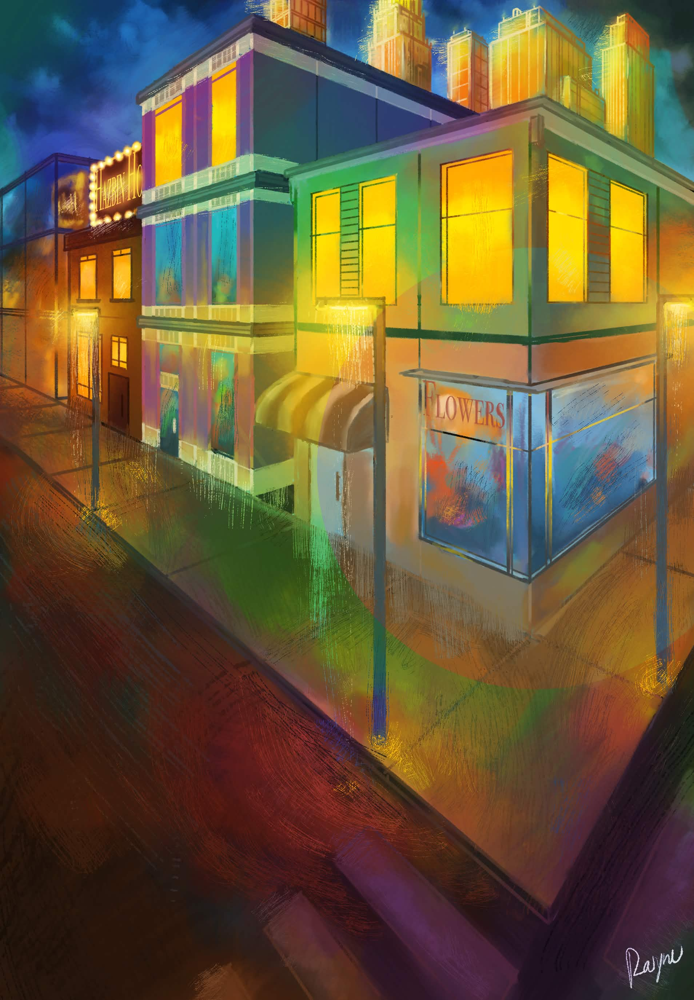
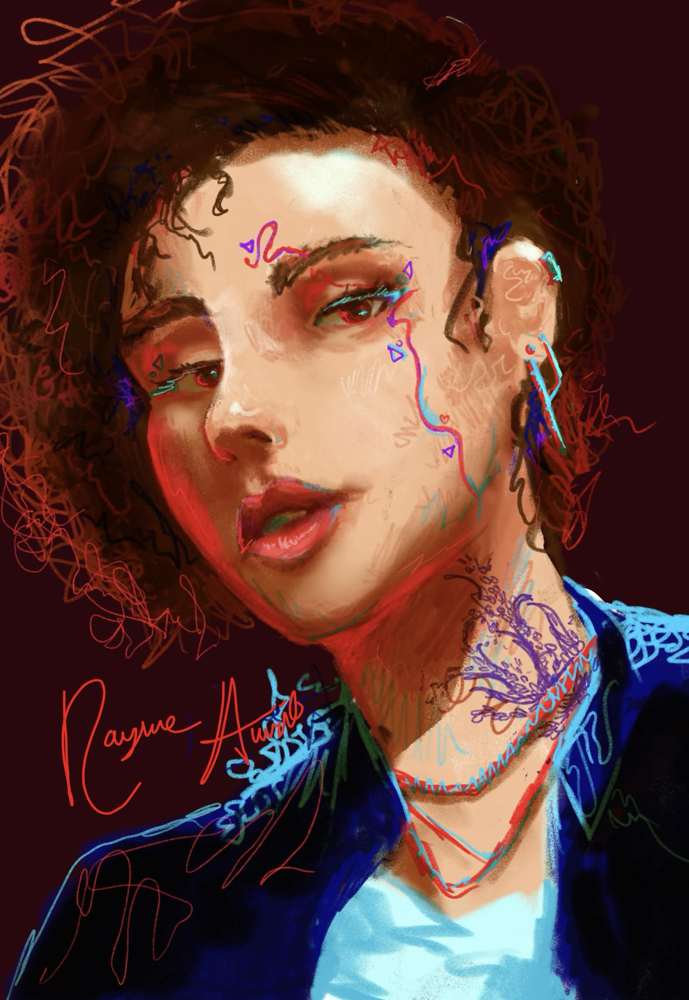
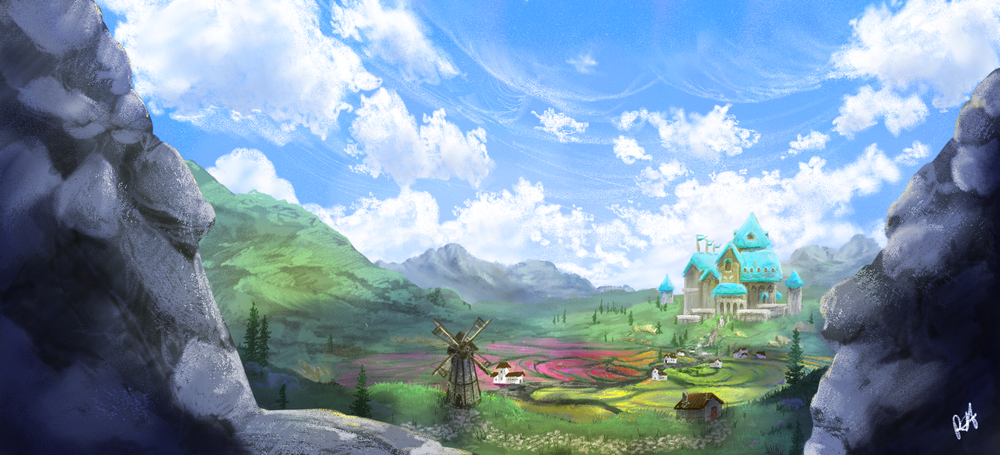
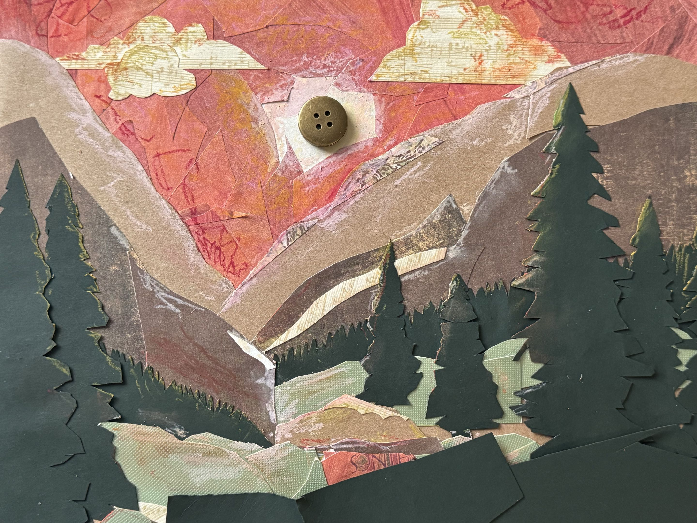
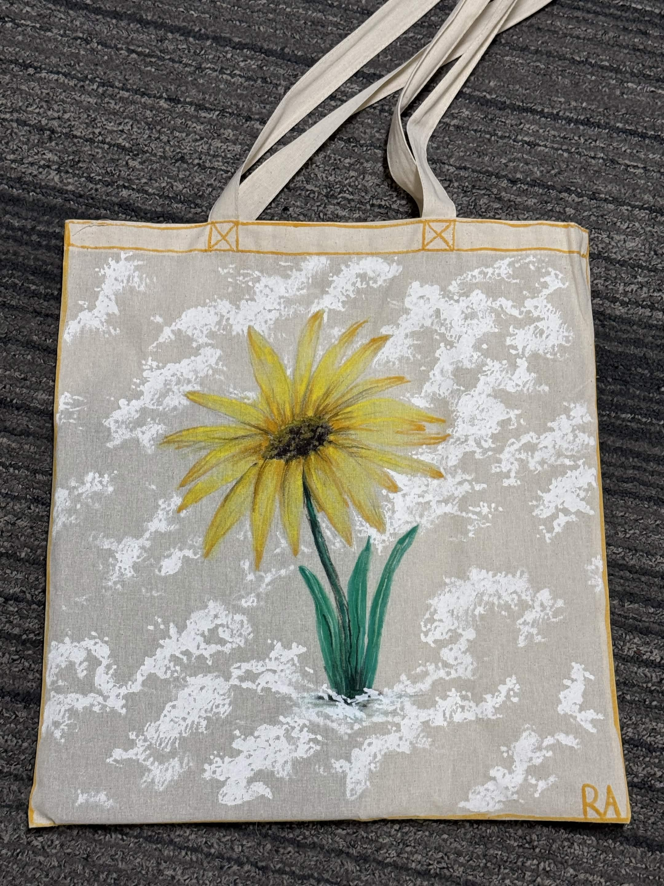
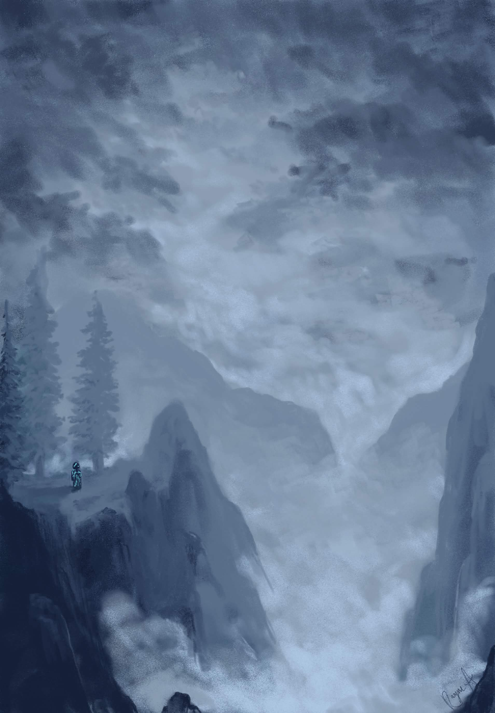
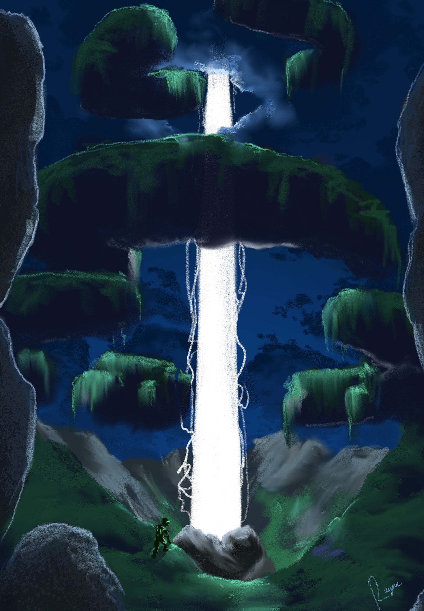
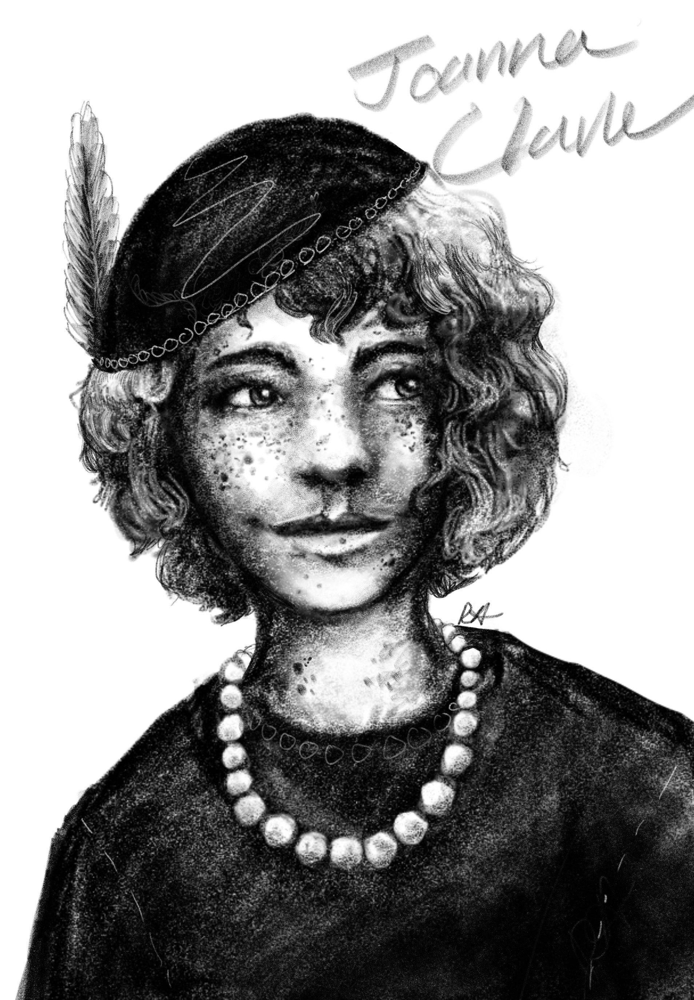
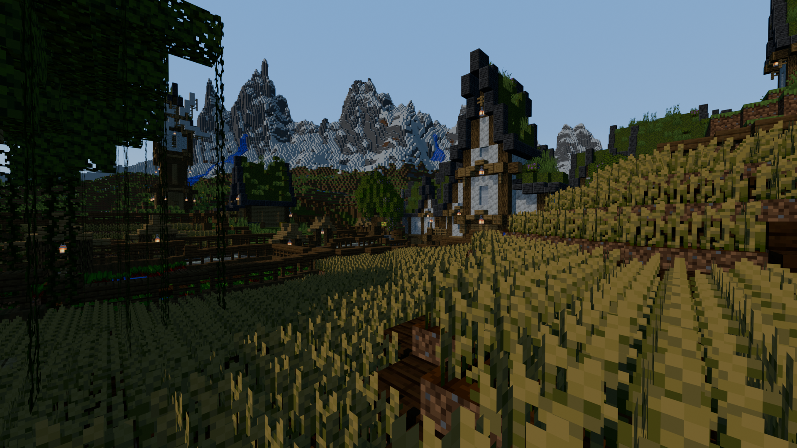
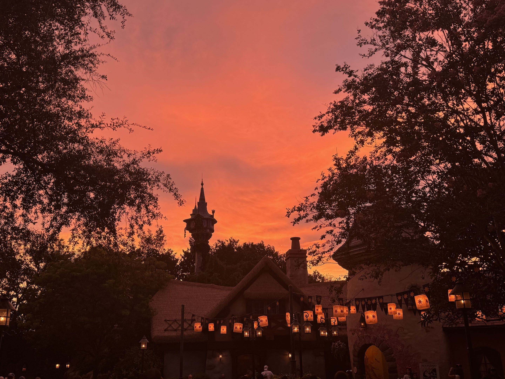

::: {.content-visible}

:::

# Art Gallery

All works here are made by yours truly! Those made digitally are done in Adobe Fresco, a personal preference of mine despite having access to Adobe Photoshop through my university. Simpler is better! I tend to use one brush (the pencil brush) and few layers. Old habits die hard coming from traditional art. Other mediums I use include acrylic painting, oil pastels, mixed materials, Minecraft (it counts!), and pencil. As you enjoy your scrolling, each image is able to be clicked on for a better zoom.

If you have any questions about my art, would like to send a comment, or are wondering about commissions, reach me at [my email](mailto::auritrayne@gmail.com).

Other art socials:

- [Art Fight](https://artfight.net/~rainbowshadow2)
- [Future Home of the Minecraft World Download]()

::: {layout-ncol=2}
{.lightbox}

{.lightbox}
:::

{.lightbox}

::: {layout-ncol=2}
{.lightbox}

{.lightbox}
:::

{.lightbox}

::: {layout-ncol=2}
{.lightbox}

{.lightbox}
:::

{.lightbox}

::: {layout-ncol=2}
{.lightbox}

{.lightbox}
:::

{.lightbox}

::: {layout-ncol=2}
{.lightbox}

{.lightbox}
:::

{.lightbox}

::: {layout-ncol=2}
{.lightbox}

{.lightbox}
:::

{.lightbox}

::: {layout-ncol=2}
{.lightbox}

{.lightbox}
:::

# Minecraft Builds and Blender

{.lightbox}

{.lightbox}

{.lightbox}

{.lightbox}

{.lightbox}

# Photography
{.lightbox}

::: {layout-ncol=2}
{.lightbox}

{.lightbox}
:::

{.lightbox}

::: {layout-ncol=2}
{.lightbox}

{.lightbox}
:::

::: {layout-ncol=2}
{.lightbox}

{.lightbox}
:::