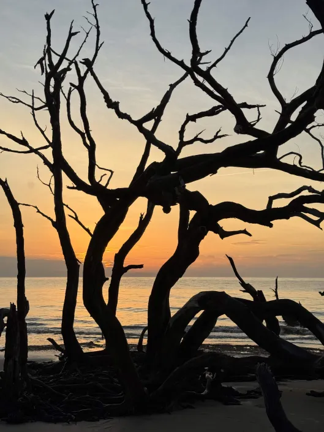
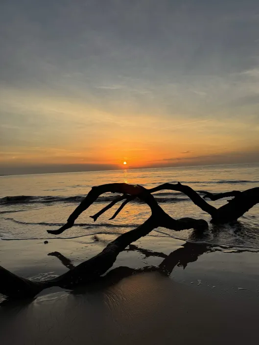
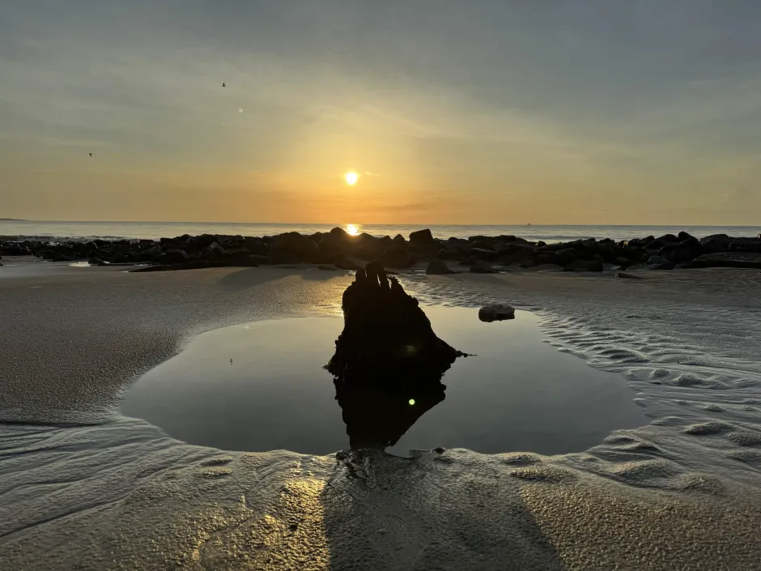
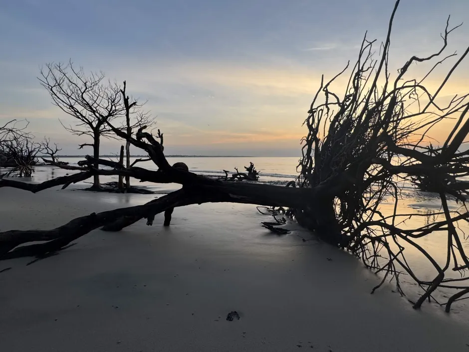
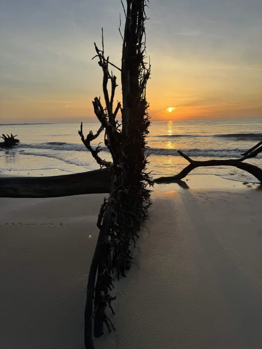
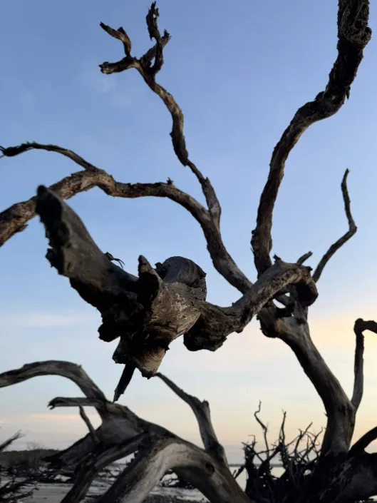
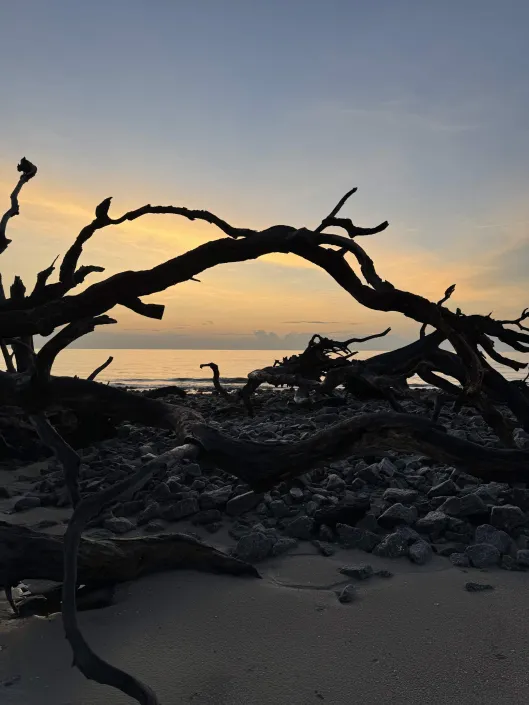
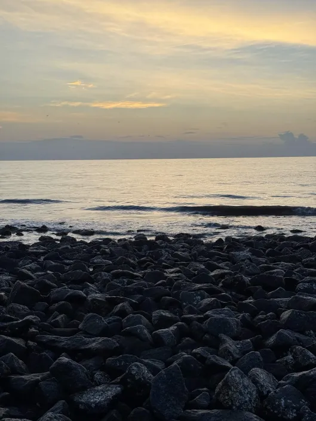
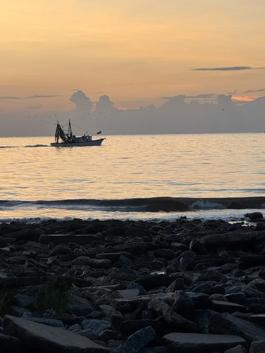
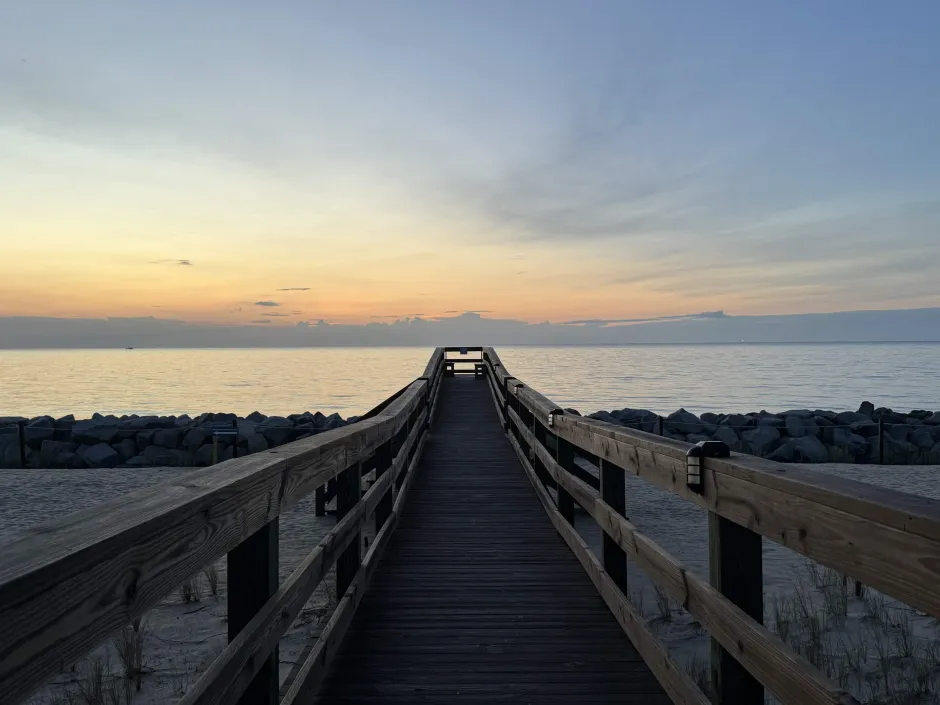

*Photography; Rayne Aurit, June, 2025*

Last summer, I had the pleasure of attending the Southern Regional Council on Statistics Research Conference (SRCOS SRC, unofficially pronounced as "circus") as part of SURE (Statistics Undergraduate Research Experience). The goal was to present my poster[^1] after participating in research underneath Dr. Souparno Ghosh throughout the 2024-2025 school year. Unfortunately, I never got to present. The conference was not set up so that undergraduate students had statistical research to present. Instead, I decided to make the most out of my time on Jekyll Island. It was the very first conference that I traveled to on my own. Changing the phrasing and the intention made the experience a lot more enjoyable! Never before had I lived on a beachfront, though temporarily, with the only previous time seeing a beach back in September of 2011.

Towards the beginning of the conference, I decided that I wanted to take pictures at either sunset or sunrise. Programming went late beyond the sunset, so that was not an option. That left a 6:00am walk as the only option on top of a long day. 

It was beyond worth it.

This image is one of many that I was able to take on that walk.

::: {layout-ncol=2}

:::

::: {layout-ncol=2}

:::

::: {layout-ncol=2}

:::

::: {layout-ncol=2}

:::

::: {layout-ncol=2}

:::

[^1]: More information on my research can be found at [Feature Selection Using KNN](../feature-selection/index.qmd)