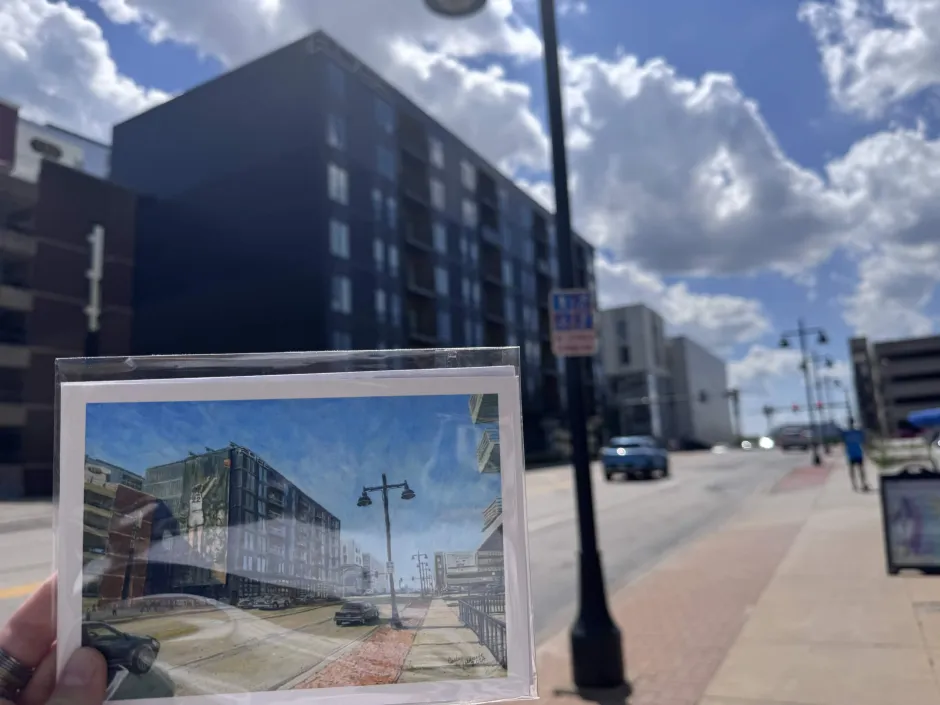

# Summertime Doom and Bloom

Summer always has a bittersweet taste. It either is beyond depressing when there is no work to do while people are busy or simply elsewhere or it is fun and the time runs too short. Nebraska in the summer is not a vacation hot spot, but that assumes that it could be at other times of the year. Aside from the Henry Doorly Zoo and the College World Series, it takes a well-informed nerd to want to trek to the flyover state and make something out of it. Even as a resident, I have not made efforts to journey out to Carhenge in northwestern Nebraska (Stonehenge with cars, it’s a pseudo wonder of the world). Instead, summer vacation, especially in the haughty neighborhoods of Elkhorn, usually entails traveling elsewhere. “The Good Life,” nah. “Honestly, it’s not for everyone,” I think they should have kept this campaign slogan.

This summer, I have been working at the University of Iowa, a double agent of sorts. I play into the rivalry for fun, mostly because I think that it is entertaining when colors become so offensive for no other reason other than associations with institutions and sporting events. It should not matter, yet it does. While another member of this research experience has noted that he would never associate with his rival school due to an event from a hundred years ago, I leaped at the opportunity. Simply, it is much easier to follow up questions about what university you come from with some spiteful twist. “Putting the L in UNL” is more fun to say than “I go to UNL.” It addresses the rivalry, there is a story that can be followed up on in a question, and it gives some more uniqueness to the response. I would hate to fall into the “What’s your major?” dull conversation pipeline and immediately forget what someone has said to me. Talking about an institution’s failure off the bat may not be the best thing to remember someone by but it does allow them to be remembered.

# Iowa vs. Nebraska, Who Reigns Supreme?

At first glance, Iowa wins for aesthetics. Their stadium isn’t their sole focus for funding and the other buildings have much more charm to them rather than simply being a hotel bought out and the insides gutted for a small mock up suggestion of an academic building (sorry, Hardin hall). The campus splits in two by the Iowa River, one dedicated to the standard undergraduate programs and residence halls and the other to the various graduate studies like their massive medical school. The arts campus lies along the river on the graduate side, buildings far more spread out along Riverside street, but each look like works of art on their own. At Lincoln, Richards hall and the Woods Arts building could be like any other building on campus. Without the title, you could not determine its purpose. These are themed, a true testament to their quality of graduates. They are stunning by my inadequate self-proclaimed taste.

What is clear here is that their arts are well-respected. Last weekend I attended the annual arts festival. Though I wish I had a space of my own that could fit a thousand-dollar painting and the funds to back it up, it was a wonderful experience. I tried funnel cake for the very first time, bought a necklace, bought a painting titled “Frogopolis” (it really fits the brand), and bought a postcard that has a giant wall art of Caitlyn Clark with the music building in the background. Downtown was almost entirely blocked off and full of vendors from all over. One came as far as Florida and asked if Nebraska was similar as she had never been - one small anecdote to prove that Iowa can have more to see than the less-than-iconic flyover state.

*Iowa The postcard painting was of a snapshot of 2024, when Caitlyn Clark had still gone to University of Iowa, pardoning the glare*

Iowa also wins for having dedicated statistics faculty (in a joint department with actuarial science) and a biostatistics department. Instead of leaving the statisticians in the dust and the actuarial department tucked neatly in the business building, they are together. Dual income of private and public support. I think the University of Nebraska-Lincoln could find some benefit from emulating that. During the University of Iowa’s budget cuts, they were forced to get rid of low student enrollment majors and focused on the arts, such as the gender studies and other related majors. I do not mean for it to imply that I would rather see the arts majors go. In fact, this time is the most important for an emphasis and protection of the arts, but in terms of pure budgetary restriction, a STEM program often brings in more money. Nebraska, on the other hand, has shot itself in the foot for years to come.

So far, Iowa far trumps Nebraska. I would not call myself a “football fan” but I do enjoy watching the Huskers play in Memorial and being able to perform alongside them. Game day energy or stadium energy in general is something that cannot be replaced. Memorial stadium will become more like a pro stadium in the next few years as the south stadium renovations go underway. Fans will be able to stay indoors completely when walking around. Meanwhile, I biked around Kinnick Stadium and could see down into the field even from the outside. Despite not having a fancy field dolled up in stark tall concrete pillars and glass windows, their football team has beat ours several years in a row. It turns out that you do not need expensive facilities in order to get a winning season.

# So Um… How Did We Get Here?

My goal for this summer, in preparation for applying to graduate school, was to get research experience at a different university. It was a risky move, waiting for so long to apply to anything. Truthfully, with the desperation to save the Statistics Department in the fall semester, I could hardly focus on anything else. Internship applications sent: zero. Instead of wallowing in the missed industry internship prime application season, I refocused towards applying to as many REU’s as I could. After months of silence and sending words into the void (generally, applications only start to get reviewed around March), I heard back from the University of Iowa’s Computing for Health and Well Being REU. I accepted.

For the past two and a half weeks, this research opportunity has allowed me to work underneath Dr. Juanpablo Hourcade on the “Ethics of Emerging Technology with Children,” put briefly by the topic of interest. In more detail, a national survey was deployed asking about parental and professional opinions on the ethics of studying extended reality with children. As a fledgling statistician, I am helping with reviewing the analysis and preparing the results for publication.

Never before have I seen try catches used in R, and it continuously perplexes me how little I know about R. Despite years of coursework using the language, it is much different to be experimenting with packages and features, understanding methods foreign to me without a professor guiding the syntax. In most cases, I believe that R is not taught in a way that promotes future learning of R. Instead of teaching the tools of how to learn R, they treat R as a sophisticated calculator where only two buttons and two specific uses are taught per course. All practical solutions to this issue are up to the student and their willingness to engage with R outside of the limited class time spent covering specific curriculum. I wouldn’t imagine that a professor would spend more than a day trying to catch one student up who hadn’t had basic statistical computing courses. It is assumed. Most professors do not provide tools or external resources to solve this issue.

If, or when, I become a professor of the sort, I would love to engage with this issue. Since my majors are both computer science and statistics, a beautiful marriage would be to become a computational statistics expert. With this project, the analysis is done repeatedly. The code is set up to automatically cycle through the responses of every survey question (over 30), and test for statistical significance in the predictors in determining the ranking of responses for each question. Being able to read and understanding someone else’s code is a skill that I need to learn more. That will come with time with the language and further experimentation. Taking a function and putting it into a sandbox is my favorite brute force method of seeing how different inputs result in different outputs.

All I can say is thank goodness for proper comments and code documentation!

# Re: Arts Festival: What If?

In the middle of the art festival, there was an interactive feature. People could come up to the boards and write their own statements. Each day, they were erased so that new ideas could reach the board without too much accumulated clutter. “What if-” then fill in the blank. From responses on the board:

“What if we love everyone <3”
“What if we get a BME PhD!!!”
“What if we never met?”
“What if we frolicked in a field?”
“What if we steal the MOON!”
“What if we got games on our phones <3”
“What if we blew our savings?”
“What if we get rid of Trump!! <3”

::: {.layout-ncol=2}
{.lightbox}

{.lightbox}
:::
(Listening to fingerspit’s De Tres al Cuarto while writing this “What if” section)

Etches next to each statement act as reply, other colors responding in hearts and exclamation points. While I did not participate in writing, I stood back and admired it, took a few photos, read the questions that people left. I’m left with my own.

What if last year turned out different? What if instead of meeting with the stony faces of the Board of Regents as they condemned four programs to erasure, they tilted their head and listened? What if we got a saving grace from the athletic department instead of the news of drastic stadium renovations? What if I applied to an industry internship and remained in Nebraska? What if I knew what I wanted to do already?

As I have attended guest speaker lectures on the process of applying to graduate school and making the most out of our time here at the REU, I have been filled once again with the wonder and capabilities of universities. They are supposed to be pillars of knowledge cemented with the tradition of faculty passing down information to their students year after year, generation after generation, to create the next tomorrow. Universities are built around students. They cannot thrive without students. Without them, they are simply research institutions at best and empty halls at worst.

I had to be reminded of that.

The University of Nebraska-Lincoln has to be reminded of that.

Of course you cannot ignore the circumstances of which universities exist in. Going to college costs money, professors have to be paid in order to sustain their livelihood, running facilities costs money, and we live in an era where the funding pool is shrinking rather than growing at its normal pace. Countless research projects have been interrupted or completely scrapped due to some people asking an LLM whether or not the project funded by a particular grant is classified as DEI in any shape or form. I applied to an REU opportunity last summer that vanished completely because the wording was towards disadvantaged groups of students, those underrepresented in their field. As a queer student in a STEM field, many helping hands which once were extended to help us up our treacherous ladders of progress have been retracted by force or by conforming to this unprecedented standard. Every hand that remains, I hold dearly.

What if it wasn’t so difficult?